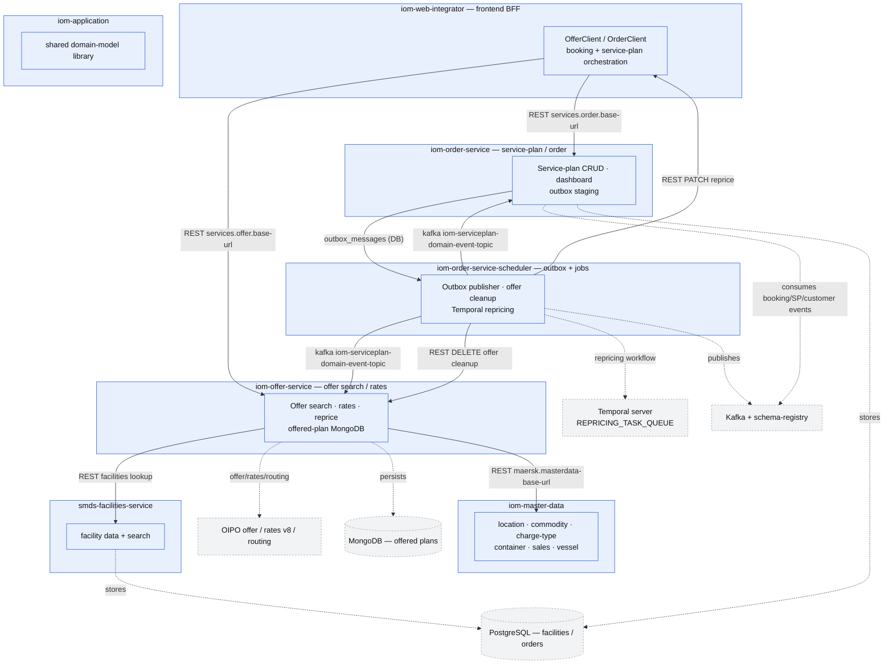

# IOM-workspace — whole-system diagram

Derived from the per-repo mini-skills + `_global_links.json` (the single source of truth → cannot
drift). Cross-repo edges are exactly the 8 entries in `_global_links.json`. External systems come from
each repo's `integrations/`. Regenerate when the underlying mini-skills change.

## Cross-repo edge legend (`_global_links.json`)

| From | To | Protocol | Topic / endpoint |
|---|---|---|---|
| iom-web-integrator | iom-offer-service | rest | `services.offer.base-url` (offer search / reprice / offered-plan) |
| iom-web-integrator | iom-order-service | rest | `services.order.base-url` (/v3/service-plans CRUD/status/search) |
| iom-offer-service | iom-master-data | rest | `${maersk.masterdata-base-url}` (location/charge/commodity/sales/container) |
| iom-offer-service | smds-facilities-service | rest | facilities lookup |
| iom-order-service | iom-order-service-scheduler | outbox-db | `outbox_messages` table |
| iom-order-service-scheduler | iom-offer-service, iom-order-service | kafka | `iom-serviceplan-domain-event-topic.local.v1` (EventNotification) |
| iom-order-service-scheduler | iom-offer-service | rest | `DELETE offered-service-plans?numberOfDays=` (offer cleanup) |
| iom-order-service-scheduler | iom-web-integrator | rest | `PATCH /service-plans/{n}/reprice` |

> `iom-application` is a shared compile-time library (no runtime cross-repo edge). It appears in
> `workspace.yml` but not in `_global_links.json`.
